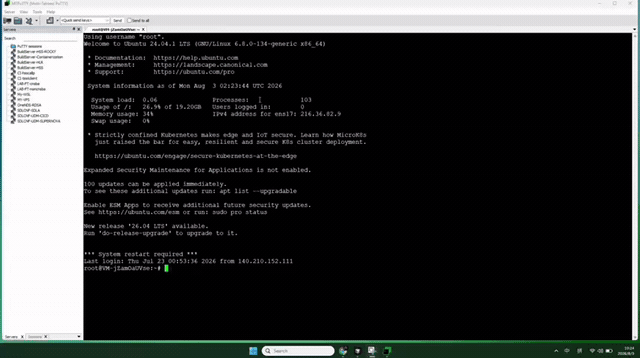

# vpn2qr

## 一条命令安装

SSH 登录 VPS 后执行：

```bash
curl -fsSL https://raw.githubusercontent.com/www222fff/vpn2qr/main/install.sh | bash
```

装完后终端会显示二维码，用手机客户端扫码导入即可。

## 支持扫码导入的客户端

- **OneXray**（iOS / Android）
- **Shadowrocket 小火箭**（iOS，2023 年后的版本支持 Reality）
- **Clash Meta / Mihomo 内核**（如 Clash Verge、FlClash、ClashMetaForAndroid 等；原版 Clash 不支持 Reality，需确认使用的是 Meta 内核）
- **v2rayN / v2rayNG**（新版本已支持 Reality）

## 安装演示



## 安全提醒

- 不要把 UUID、密钥、导入链接、二维码发到公开聊天或提交到 Git
- 仅供个人学习与自用，请遵守当地法律及服务商条款
- 本仓库不包含任何真实节点凭据

## Star History

<picture>
  <source media="(prefers-color-scheme: dark)" srcset="https://api.star-history.com/svg?repos=www222fff/vpn2qr&type=Date&theme=dark" />
  <source media="(prefers-color-scheme: light)" srcset="https://api.star-history.com/svg?repos=www222fff/vpn2qr&type=Date" />
  
</picture>
